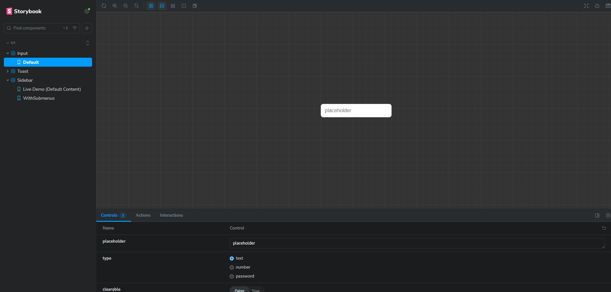
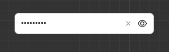
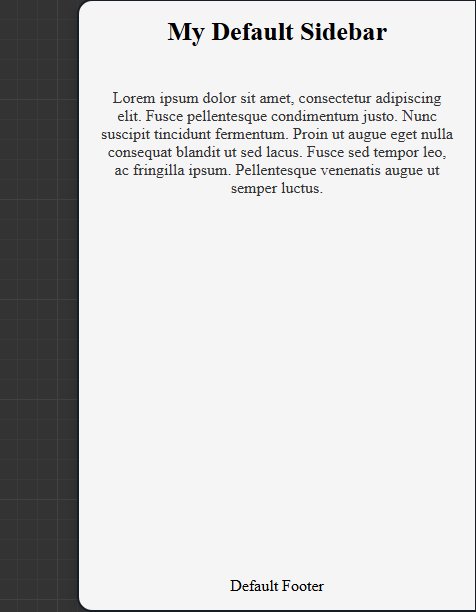
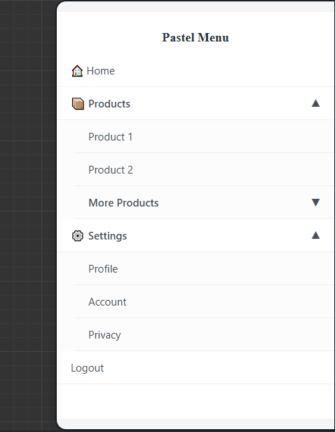
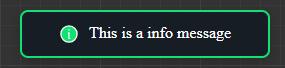
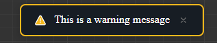
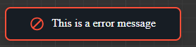

# DevelopsToday Test Task

This project is a test task implementation using React, TypeScript, and Vite. It includes a set of UI components developed in an isolated environment using Storybook.

### 🛠️ Tech Stack

- **React 19**
- **TypeScript**
- **Vite** (build tool)
- **SCSS (Sass)** (styling with CSS Modules)
- **Storybook** (for component development and demonstration)
- **Motion** (Framer Motion) (for animations)
- **ESLint** & **Prettier** (for code quality and formatting)

---

## 🚀 Setup and Launch Instructions

To run the project on your local machine, follow these steps:

1.  **Clone the repository:**

    ```bash
    git clone [https://github.com/DiReFoNt/developsToday_test-task.git](https://github.com/DiReFoNt/developsToday_test-task.git)
    ```

2.  **Navigate to the project directory:**

    ```bash
    cd developsToday_test-task
    ```

3.  **Install dependencies:**

    ```bash
    npm install
    ```

4.  **Run the dev server (main application):**

    ```bash
    npm run dev
    ```

    After this, open `http://localhost:5173` (or the port specified in your console) in your browser.

5.  **Run Storybook (for component viewing):**
    This is the recommended way to view and test the project's UI components.
    ```bash
    npm run storybook
    ```
    Storybook will be available at `http://localhost:6006`.

### ⚙️ Additional Scripts

- `npm run build`: Builds the production version of the project.
- `npm run preview`: Runs a local server to preview the production build.
- `npm run lint`: Runs ESLint to check the code for errors.
- `npm run build-storybook`: Creates a static build of Storybook.

---

## 🏛️ Component Overview

All components are developed using **SCSS Modules** for style encapsulation and **TypeScript** for strict typing. The components are documented and showcased in **Storybook**.

The project includes the following main components (located in `src/components`):

### 1. Input

- **Files:** `Input.tsx`, `Input.module.scss`, `Input.stories.tsx`
- **Description:** A customized input field component (`<input>`). It is isolated and has its own styles.
- **Screenshots:**
  - **Default Input:**
    
  - **Password Input:**
    

### 2. Sidebar

- **Files:** `Sidebar.tsx`, `Sidebar.module.scss`, `Sidebar.stories.tsx`
- **Description:** A sidebar component. It is likely used for the main application navigation. The `motion` library may be used for animations (e.g., sliding in/out).
- You can also transfer any components to the header, content, or footer sections of the sidebar.
- **Screenshots:**
  - **Default Sidebar:**
    
  - **Sidebar with Menu:**
    

### 3. Toast

- **Files:** `Toast.tsx`, `Toast.module.scss`, `Toast.stories.tsx`, `Toast.types.ts`
- **Description:** A "Toast" (pop-up notification) component. The presence of a separate `Toast.types.ts` file suggests that the component accepts various `props` to configure its behavior and appearance (e.g., `type: 'success' | 'error'`). The `motion` library is likely used for its appear/disappear animations.
- **Screenshots:**
  - **Info Toast:**
    
  - **Warning Toast:**
    
  - **Error Toast:**
    
